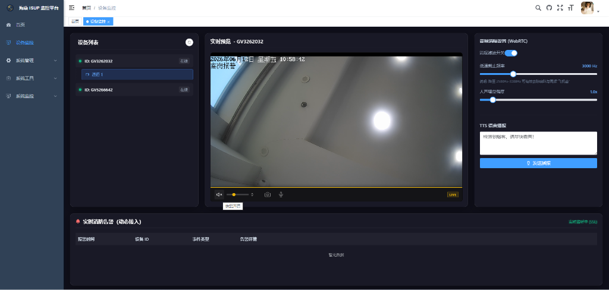

# 海康威视 ISUP (EHome) 视频监控与流媒体管理平台

基于 **RuoYi-Vue** 快速开发框架进行定制开发，集成了海康威视 **ISUP (EHome)** 主动注册协议，结合高性能流媒体服务器 **ZLMediaKit**，实现了海康摄像头/录像机的注册接入、实时超低延迟视频预览、WebRTC 实时音频降噪控制、智能语音 TTS 广播及实时告警动态监听等功能。

---

## 🖥️ 平台预览



---

## 🔗 开源地址

* **Gitee 仓库**：[https://gitee.com/super_888/ruoyi-hik-isup](https://gitee.com/super_888/ruoyi-hik-isup)
* **GitHub 仓库**：[https://github.com/super8p/ruoyi-hik-isup](https://github.com/super8p/ruoyi-hik-isup)

---

## 🌟 开源功能特性

1. **海康 ISUP (EHome) 协议主动注册**
   * 支持海康外网/局域网设备通过 ISUP/EHome 协议安全穿透并主动注册到平台，免去复杂的路由器端口映射。
2. **超低延迟 WebRTC 视频预览**
   * 底层与 ZLMediaKit 高性能流媒体服务器无缝集成，提供毫秒级的 WebRTC 实时视频流预览，告别传统的 FLV/HLS 高延迟。
3. **高级音频播放与交互控制**
   * **静音保护策略**：默认进入静音状态以绕过浏览器的自动播放策略限制；开启声音后音量默认 30%。
   * **音量智能调节**：前端集成 Hover 悬浮展开式音量滑块，支持实时音量数值百分比（0 - 100）动态显示与调节。
   * **自动重置机制**：切换通道时自动重置为静音状态，打开后重置为 30% 音量。
4. **实时音频数字信号处理 (DSP) 与降噪**
   * **截止频率滤波器**：前端集成了 Web Audio API 高通/低通截止频率滤波器，支持在 2500Hz-3000Hz 区间调节，彻底滤除对讲与监控流的高频噪音（飞机音）。
   * **人声增益放大**：支持在 0.0x 至 2.0x 范围调节人声增益强度，显著提升双向对讲和监控中的声音清晰度。
5. **智能 TTS 语音合成广播**
   * 集成 Microsoft Edge TTS 高清语音合成播报服务。
   * 内置流控防护、调用速率限制与安全熔断机制，实现突发灾情状态下的稳定自动语音广播（例如“检测到烟雾，请尽快撤离！”）。
6. **实时告警推送 (SSE)**
   * 基于 Server-Sent Events (SSE) 长连接实现后端与前端的告警状态直连推送，首页能够毫秒级同步接收并动态渲染消防等告警事件。
7. **极简 JNA 资源与生命周期管理**
   * 优化了 JNA 底层 SDK 资源的管理，在流停止/通道切换时强制释放与关闭预览/回放回调流，彻底解决了高并发切换通道时的 `SocketException: Socket closed` 异常，保证系统 7*24h 稳定运行。

---

## 🚀 启动与部署说明

### 后端服务启动 (Spring Boot)

1. **准备流媒体环境**
   * 部署 ZLMediaKit 流媒体服务器（推荐配置地址为 `192.168.1.179:7788`，签名秘钥为 `hik12345`）。
2. **初始化数据库**
   * 导入项目 `sql/` 目录下的系统 SQL 脚本至 MySQL 数据库。
3. **修改配置文件**
   * 编辑 `ruoyi-admin/src/main/resources/application.yml` 与 `application-druid.yml`，修改数据库连接参数、Redis 缓存地址及 ZLMediaKit 的 API 连接信息。
4. **运行启动类**
   * 运行 `com.oldwei.isup.RuoYiApplication.java` 启动后端服务。

### 前端服务启动 (Vue 3 + Vite)

1. **配置环境变量**
   * 可在 `ruoyi-ui/.env.development` 中修改后台请求网关配置 `VITE_APP_BASE_API`。
2. **安装依赖**
   ```bash
   cd ruoyi-ui
   npm install
   ```
3. **开发模式运行**
   ```bash
   npm run dev
   ```
   * 浏览器访问：`http://localhost`

---

## 👨‍💻 作者与社区

* **作者 QQ**：27988448
* **交流 QQ群**：859712927
* **授权许可**：**开源免费**，支持个人与企业免费商用，遵循 MIT 开源协议。

---

## ☕ 打赏与支持

如果您觉得该监控平台对您的工作或学习有所帮助，欢迎打赏一杯咖啡支持作者的持续维护与更新！

| 微信支付 | 支付宝支付 |
| :---: | :---: |
|  |  |

---